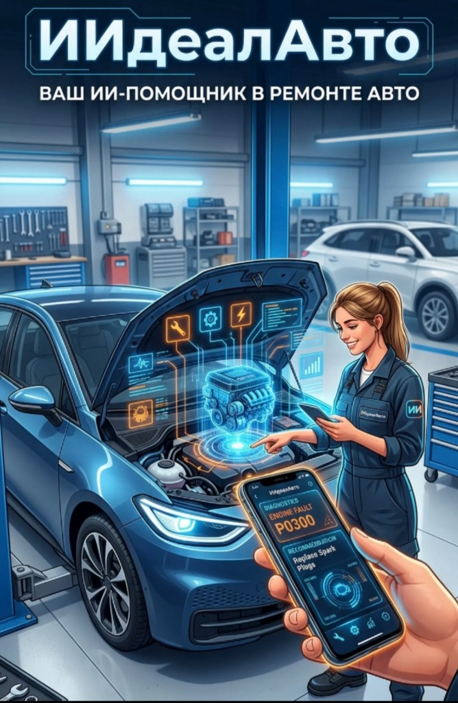

# «ИИдеал Авто» (AIdeal Auto) — Экспертная ИИ-система автодиагностики и пошагового ремонта (Google Gemma 4 12B + AirLLM + RAG BERT + Dual-Mode AR HUD)

<p align="center">
  
</p>

**«ИИдеал Авто» (AIdeal Auto)** — полнофункциональная кроссплатформенная экспертная система для автомастерских, сервисных центров, диагностов и автолюбителей. Система выполняет комплексную диагностику неисправностей автомобилей по описанию симптомов, кодам ошибок OBD-II (DTC), логам сканеров, нативным голосовым записям и фотографиям узлов или приборной панели с формированием специфицированного инвентаря и интерактивных пошаговых чеклистов ремонта.

Система полностью автономна (**без зависимости от внешних облаков или серверов `llama-server`**) и работает на базе послойного движка **[AirLLM](https://github.com/lyogavin/airllm)** с мультимодальной нейросетью **Google Gemma 4 12B Unified** (`google/gemma-4-12B-it-qat-w4a16-ct`, 48 слоев, Text + Vision + Audio), гибридным ядром **RAG (BERT + FAISS + BM25 + CrossEncoder)**, нативным аудиовходом, окном контекста **32K токенов**, бюджетом ответа **~5000 токенов** с автообрезкой по предложениям и двухрежимным HUD дополненной реальности для очков **RayNeo**.

---

## Содержание
1. [Быстрый старт и автозагрузка модели](#1-быстрый-старт-и-автозагрузка-модели)
2. [Архитектура и ключевые возможности](#2-архитектура-и-ключевые-возможности)
3. [Послойный движок AirLLM для Google Gemma 4 12B](#3-послойный-движок-airllm-для-google-gemma-4-12b)
4. [Гибридная RAG-система на базе BERT и FAISS](#4-гибридная-rag-система-на-базе-bert-и-faiss)
5. [Прямой нативный аудиовход (Direct Gemma 4 Audio)](#5-прямой-нативный-аудиовход-direct-gemma-4-audio)
6. [Окно токенов (32K контекст, ~5000 ответ) и автообрезка](#6-окно-токенов-32k-контекст-5000-ответ-и-автообрезка)
7. [Динамический воркер памяти и удержание 5 последних реплик](#7-динамический-воркер-памяти-и-удержание-5-последних-реплик)
8. [Двойной AR-режим для очков RayNeo и видеокамер](#8-двойной-ar-режим-для-очков-rayneo-и-видеокамер)
9. [Многопользовательская изоляция, проекты и авторизация](#9-многопользовательская-изоляция-проекты-и-авторизация)
10. [Структура проекта и относительные пути](#10-структура-проекта-и-относительные-пути)
11. [Строгий JSON-формат, Function Calling и чеклисты ремонта](#11-строгий-json-формат-function-calling-и-чеклисты-ремонта)
12. [Запуск в Docker и отладка в VSCode](#12-запуск-в-docker-и-отладка-в-vscode)
13. [Справочник REST API и автотесты](#13-справочник-rest-api-и-автотесты)

---

## 1. Быстрый старт и автозагрузка модели

> **Примечание по весам:** Веса нейросетей не хранятся в git-репозитории. При первом запуске `run_dev.ps1` (или скрипта `prepare_airllm_model.py`) система автоматически скачивает модель **Google Gemma 4 12B** и модели RAG BERT, нарезая их на 52 независимых послойных шарда AirLLM.
> Личный HuggingFace токен указывать в коде не требуется (при необходимости передайте его через переменную окружения `$env:HF_TOKEN`).

### Способ А. Запуск в одну команду на Windows (PowerShell)
Скрипт `run_dev.ps1` сам создаст `.venv`, установит PyTorch с поддержкой GPU CUDA 12.4, скачает и подготовит шарды Gemma 4 12B, применит миграции и запустит веб-интерфейс:

```powershell
.\run_dev.ps1
```

### Способ Б. Пошаговая ручная установка на Windows (PowerShell)
```powershell
# 1. Создание виртуального окружения
python -m venv .venv

# 2. Установка PyTorch с поддержкой GPU (CUDA 12.4)
.\.venv\Scripts\python.exe -m pip install --upgrade pip
.\.venv\Scripts\python.exe -m pip install torch torchvision torchaudio --index-url https://download.pytorch.org/whl/cu124

# 3. Установка зависимостей проекта
.\.venv\Scripts\python.exe -m pip install -r requirements.txt

# 4. Скачивание Google Gemma 4 12B и нарезка на шарды AirLLM (~7.5 ГБ)
.\.venv\Scripts\python.exe prepare_airllm_model.py

# 5. Применение миграций БД SQLite
.\.venv\Scripts\python.exe manage.py migrate

# 6. Запуск сервера с автоматической предзагрузкой модели в GPU VRAM
.\.venv\Scripts\python.exe manage.py runserver 0.0.0.0:8000 --noreload
```

### Способ В. Запуск на Linux (Bash)
```bash
chmod +x run_dev.sh
./run_dev.sh
```

### Адреса после запуска
- **Главный веб-интерфейс (Desktop + Mobile PWA):** [http://127.0.0.1:8000/](http://127.0.0.1:8000/)
- **Режим для AR-очков (RayNeo Optical / Видео-фон):** [http://127.0.0.1:8000/ar/](http://127.0.0.1:8000/ar/)
- **Консольный режим (CLI):** `.\.venv\Scripts\python.exe MAIN_app_with_LLM.py`

---

## 2. Архитектура и ключевые возможности

```
┌────────────────────────────────────────────────────────────────────────────────────────┐
│                   КЛИЕНТСКИЙ УРОВЕНЬ «ИИДЕАЛ АВТО» (PWA / AR HUD / Desktop)            │
│  • Фирменный стиль ИИдеал Авто + логотип + векторные иконки SVG (192 / 512)           │
│  • Два режима AR: 1) RayNeo Optical (#000000) 2) Камера-фон (Video Passthrough)        │
│  • Мгновенный Optimistic UI + анимированный индикатор послойной генерации             │
│  • Прямой аудиоввод (без Whisper), прикрепление фото, логов и словаря DTC              │
└───────────────────────────────────────────┬────────────────────────────────────────────┘
                                            │ HTTP / JSON / Multipart
┌───────────────────────────────────────────▼────────────────────────────────────────────┐
│                       БЭКЕНД DJANGO (autodiag_project & diagnostics)                   │
│  ┌───────────────────────────────┐   ┌──────────────────────────────────────────────┐  │
│  │ Динамический воркер памяти    │   │ Оркестратор AirLLM Gemma 4 12B               │  │
│  │ (diagnostics/context_worker)  │   │ (diagnostics/airllm_vulkan_service.py)       │  │
│  │ • Окно контекста 32K токенов  │   │ • Автоматическая предзагрузка в GPU VRAM     │  │
│  │ • Динамический расчет бюджета │   │ • Ответ модели ~5000 токенов                 │  │
│  │ • Память 5 последних реплик   │   │ • Автообрезка truncate_to_last_sentence      │  │
│  │ • Мгновенный сброс (0 мс)     │   │ • Строгая Pydantic v2 JSON Schema            │  │
│  └───────────────────────────────┘   └──────────────────────┬───────────────────────┘  │
└─────────────────────────────────────────────────────────────┼──────────────────────────┘
                                                              │
         ┌────────────────────────────────────────────────────┼─────────────────────┐
         ▼                                                    ▼                     ▼
┌─────────────────────────────────┐  ┌─────────────────────────────────┐  ┌───────────────────────┐
│ Гибридный RAG-движок (engine.py)│  │ AdaptiveAirLLMGemma4 (AirLLM)   │  │ Стек GPU / Vulkan /   │
│ • Bi-Encoder Multilingual-MiniLM│  │ • Google Gemma 4 12B (48 слоев) │  │ CUDA (vulkan_backend) │
│ • FAISS IndexFlatIP (Cosine Sim)│  │ • Вход Vision + Direct Audio    │  │ • Закрепление в VRAM  │
│ • BM25Okapi + N-gram фильтрация │  │ • W4A16 QAT квантование         │  │ • PCIe DMA Pinned     │
│ • CrossEncoder mmarco-mMiniLMv2 │  │ • Стриминг слоев без OOM       │  │   Memory стриминг     │
└─────────────────────────────────┘  └─────────────────────────────────┘  └───────────────────────┘
```

---

## 3. Послойный движок AirLLM для Google Gemma 4 12B

В модуле [`diagnostics/airllm_vulkan_service.py`](file:///d:/GDrive/Документы/Visual%20Studio%202022/ExpertSystem_auto_diag/diagnostics/airllm_vulkan_service.py) реализован движок **`AdaptiveAirLLMGemma4`**:
- **Модель**: `google/gemma-4-12B-it-qat-w4a16-ct` (12 миллиардов параметров, 48 декодер-слоев, 4-битное квантование весов W4A16, 7.54 ГБ).
- **Нарезка**: Модель разделена на **52 независимых шарда** safetensors (`model.language_model.embed_tokens`, `model.language_model.layers.0..47`, `model.language_model.norm`, `model.embed_vision`, `model.embed_audio`).
- **GPU VRAM & DMA Residency**:
  - На видеокартах с 8 ГБ VRAM (например, RTX 3050) в памяти постоянно удерживаются эмбеддинги, нормализация и до 32–36 декодер-слоев.
  - Оставшиеся слои стримятся через хуки AirLLM из закрепленной оперативной памяти (page-locked pinned RAM) по шине PCIe DMA с немедленным освобождением, полностью исключая ошибки нехватки видеопамяти (Out-of-Memory).

---

## 4. Гибридная RAG-система на базе BERT и FAISS

Архитектура RAG в [`engine.py`](file:///d:/GDrive/Документы/Visual%20Studio%202022/ExpertSystem_auto_diag/engine.py) полностью воспроизводит эталонную логику коммита `4c196ae3d4751845fefce7e8f1cde6f77bdb37ed` и работает автоматически из коробки:
1. **Векторный поиск**: Модель `sentence-transformers/paraphrase-multilingual-MiniLM-L12-v2` формирует плотные эмбеддинги для базы знаний `kb_data.json` и эталонной телеметрии `VehicleDiagnosticSample.txt` (32 733 записи). Индекс `faiss.IndexFlatIP` отбирает топ-10 семантических кандидатов.
2. **Лексический поиск**: `BM25Okapi` и триграммный N-gram анализатор отбирают топ-10 лексических кандидатов с принудительным бустингом точных кодов OBD-II (DTC).
3. **Объединение и реранкинг**: Модель `cross-encoder/mmarco-mMiniLMv2-L12-H384-v1` выполняет глубокое попарное переранжирование объединенного пула кандидатов с учетом формулы остаточного ресурса `(100 - health_index) / 200`.
4. **Автокэширование**: Эмбеддинги кэшируются в директорию `models/rag_cache/` по контрольной сумме SHA-256 исходных данных (мгновенный повторный старт).
5. **Точность**: По бенчмарку `evaluate_model.py` система обеспечивает **Recall@3 = 100%** и **MRR = 1.000** при времени отклика всего **~4.5 мс**.

---

## 5. Нативный аудиовход (Gemma 4 embed_audio) и чистое хранение вложений в БД (Base64 Data URI)

Все прикреплённые материалы (фотографии узлов, снимки с камеры, логи OBD-II, документы PDF/DOCX и аудиозаписи) сохраняются **напрямую в базе данных SQLite в виде base64 Data URI** (`data:<mime>;base64,...`), без записи файлов на диск сервера:
- **Полная автономность и безопасность**: На сервере не накапливаются временные файлы в директории `media/`, а резервное копирование и экспорт диалогов инкапсулированы внутри базы данных.
- **Прямой нативный аудиовход (Direct Gemma 4 Audio)**: Сервис [`diagnostics/voice_service.py`](file:///d:/GDrive/Документы/Visual%20Studio%202022/ExpertSystem_auto_diag/diagnostics/voice_service.py) декодирует аудиозаписи любых форматов (`.webm`, `.wav`, `.mp3`, `.ogg`, `.m4a`) в **16 кГц моно float32 тензор** с фильтрацией DC offset и нормализацией амплитуды для аудио-проектора `model.embed_audio` Gemma 4. **Сторонние модели распознавания речи (Whisper) полностью исключены** — распознавание русской речи мастера и акустический анализ шумов автомобиля осуществляются исключительно нативно архитектурой Google Gemma 4 12B Unified.

---

## 6. Окно токенов (32K контекст, ~5000 ответ) и автообрезка

1. **Окно контекста (`context_window_tokens`)**: Расширено до **`32768` токенов (32K)** по умолчанию. Это позволяет загружать детальные диагностические карты, дампы телеметрии и длинную историю диалога.
2. **Бюджет ответа модели (`max_new_tokens`)**: Установлен на уровне **`5000` токенов** для формирования развернутых инструкций по ремонту.
3. **Автообрезка по предложениям (`truncate_to_last_sentence`)**: Механизм в [`diagnostics/schemas.py`](file:///d:/GDrive/Документы/Visual%20Studio%202022/ExpertSystem_auto_diag/diagnostics/schemas.py) отслеживает границы предложений (точки, вопросительные и восклицательные знаки, закрывающие кавычки и скобки) и гарантирует, что ответ модели никогда не обрывается на полуслове.
4. **Стиль ответа**: Системный промпт инструктирует модель писать емким, технически точным языком, без лишней «воды» и повторения банальных инструкций.

---

## 7. Динамический воркер памяти и удержание 5 последних реплик

1. **Динамический расчет бюджета контекста**: Фоновый воркер [`diagnostics/context_worker.py`](file:///d:/GDrive/Документы/Visual%20Studio%202022/ExpertSystem_auto_diag/diagnostics/context_worker.py) динамически вычисляет объем свободного места в окне 32K токенов:
   $$\text{free\_context} = \text{context\_window} - \text{reserved\_tokens} - \text{recent\_tokens}$$
   и адаптирует степень сжатия фоновой сводки под размер активного контекста.
2. **Прямая оперативная память (5 последних реплик)**: В рабочий промпт нейросети передаются **последние 5 сообщений пользователя и 5 ответов ИИ** с сохранением ключевых фактов, кодов ошибок и статуса чекбоксов.
3. **Мгновенный сброс (Zero-Wait Preemption)**: При отправке нового вопроса фоновый воркер мгновенно сбрасывается (`0 мс`), отвечая без задержек.

---

## 8. Двойной AR-режим для очков RayNeo и видеокамер

На странице `/ar/` (кнопка **«AR HUD»** в шапке) реализованы два подрежима:
1. **Подрежим 1: «RayNeo Optical»**:
   - Чисто черный оптический фон (`#000000`). На MicroOLED экранах AR-очков (RayNeo X2, Air 2) черный цвет не излучает свет и становится 100% прозрачным в поле зрения.
   - Окно визира камеры (`#arWindowCamera`) отображается для прицеливания и съемки проблемных узлов.
2. **Подрежим 2: «Камера-фон (Video Passthrough)»**:
   - Полноэкранный живой видеопоток с камеры смартфона или веб-камеры в качестве фонового слоя. Предназначен для очков без прозрачного экрана и видео-шлемов.
   - Внутреннее окно камеры автоматически скрывается, исключая дублирование картинки.
- **Интегрированная навигация и сессии в AR**:
   - Выпадающий список сессий (`#arSessionSelect`) и кнопка создания нового диалога (`#btnArNewSession`) прямо в верхней панели статуса AR.
   - Переключение диалогов мгновенно подгружает историю сообщений в окно ассистента (`#arWindowAssistant`).
- **Стейджинг материалов в AR HUD (`#arStagingBar`)**:
   - Все прикрепленные аудиозаписи, сделанные снимки с камеры и добавленные коды DTC отображаются в виде интерактивных чипов прямо над панелью ввода в AR с возможностью удаления перед отправкой.
- **Быстрые действия в поле зрения**:
   - Кнопка мгновенной съемки и отправки фото (`#btnArSnapInAssistant`), голосовая запись (`#btnArVoiceTriggerAssistant`), перетаскивание плавающих панелей (`Pointer Events`).

---

## 9. Многопользовательская изоляция, проекты и авторизация

Система поддерживает как гостевой режим работы, так и полноценную изоляцию рабочих пространств:
- **Изоляция сессий и проектов**: Каждый зарегистрированный пользователь видит исключительно свои проекты автодиагностики, историю диалогов, прикрепленные фото и аудиозаписи.
- **Управление сессиями**: Закрепление важных чатов (Pin), тегирование по агрегатам автомобиля (ДВС, АКПП, Тормоза, Электрика и др.), переименование на лету и удаление отдельных сообщений или целых диалогов с автоматической синхронизацией памяти контекста.
- **Архитектура базы данных и репозитория**:
  - Рабочая база `db.sqlite3` исключена из git (`.gitignore`), что гарантирует конфиденциальность пользовательских данных и защиту от случайных перезаписей.
  - В репозитории хранится чистая эталонная копия **`db_clean.sqlite3`** со всеми примененными миграциями и предсозданными учетными записями. При первом запуске Django автоматически инициализирует `db.sqlite3` из `db_clean.sqlite3`.
- **Учетные данные пользователей в чистой копии**:
  - **Администратор (Admin / Superuser):**
    - Логин: `admin`
    - Пароль: `AIdealAutoAdmin2026!`
    - Панель управления Django: [http://127.0.0.1:8000/admin/](http://127.0.0.1:8000/admin/)
  - **Тестовый механик (Test User):**
    - Логин: `mechanic`
    - Пароль: `Mechanic2026!`

---

## 10. Структура проекта и относительные пути

Все пути в проекте строго относительны к корню репозитория (`BASE_DIR`):

```text
ExpertSystem_auto_diag/
├── autodiag_project/              # Конфигурация Django (settings, urls, wsgi, asgi)
├── diagnostics/                   # Основное приложение экспертной системы «ИИдеал Авто»
│   ├── apps.py                    # Автоматическая предзагрузка AirLLM Gemma 4 в GPU VRAM при старте
│   ├── airllm_vulkan_service.py   # AdaptiveAirLLMGemma4 + стриминг слоев + Function Calling
│   ├── context_worker.py          # Динамический вытесняемый воркер памяти (окно 32K, 5 реплик)
│   ├── document_service.py        # Универсальный парсер документов (.pdf, .docx, .txt, .log, .json, .csv)
│   ├── voice_service.py           # Нативный аудиовход 16 кГц float32 для Gemma 4 (embed_audio)
│   ├── schemas.py                 # Pydantic v2 схемы, JSON Schema и truncate_to_last_sentence
│   ├── models.py                  # Модели SQLite: SystemSettings, DiagnosticProject, DialogSession, ChatMessage
│   ├── views.py                   # Представления интерфейса, авторизации, REST API и PWA
│   ├── urls.py                    # Маршруты веб-приложения
│   └── tests.py                   # Комплексный набор автотестов (11 тестов)
├── templates/diagnostics/
│   └── index.html                 # Единый интерфейс (Desktop + Mobile PWA + RayNeo AR HUD + Auth Modal)
├── static/
│   ├── css/app.css                # Фирменные стили ИИдеал Авто, Industrial HUD, AR #000000, Auth UI
│   ├── js/app.js                  # Клиентская логика: Optimistic UI, чеклисты, камера, диктофон, AR, Auth
│   ├── js/sw.js                   # Service Worker офлайн-кэширования PWA
│   ├── icons/                     # Векторные и растровые иконки PWA (icon-192, icon-512)
│   └── images/                    # Фирменный логотип ИИдеал Авто (aideal_logo.jpg, aideal_badge.png)
├── models/                        # Локальные модели и шарды (относительные пути)
│   ├── gemma-4-12B-it/            # Конфигурация и токенизатор Google Gemma 4 12B
│   ├── airllm_shards/
│   │   └── splitted_model/        # 52 послойных шарда safetensors (embed, layers.0..47, norm, vision, audio)
│   └── rag_cache/                 # SHA-256 кэш эмбеддингов FAISS
├── prepare_airllm_model.py        # Скрипт автозагрузки и послойной нарезки Gemma 4 12B
├── vulkan_backend.py              # Менеджер видеопамяти GPU / Vulkan / CUDA
├── engine.py                      # RAG-движок (BERT bi-encoder + FAISS + BM25 + CrossEncoder)
├── kb_data.json                   # База знаний кодов неисправностей и регламентов ремонта
├── VehicleDiagnosticSample.txt    # База эталонной телеметрии (32 733 строки)
├── evaluate_model.py              # Бенчмарк RAG (Recall@3: 100%, MRR: 1.000)
├── MAIN_app_with_LLM.py           # Консольный режим диагностики через AirLLM Gemma 4
├── manage.py                      # Точка входа Django
├── run_dev.ps1                    # Быстрый запуск на Windows (PowerShell)
├── run_dev.sh                     # Быстрый запуск на Linux (Bash)
├── Dockerfile                     # Контейнер с поддержкой GPU/Vulkan и AirLLM
├── docker-compose.yml             # Конфигурация Docker Compose
└── requirements.txt               # Зависимости Python
```

---

## 11. Строгий JSON-формат, Function Calling и чеклисты ремонта

- **Типизация ответов**: Все ответы валидируются через **Pydantic v2** (`DiagnosticStructuredResponse`) и **JSON Schema**.
- **Интерактивные чекбоксы**: Инвентарь и пошаговый план ремонта снабжены живыми чекбоксами. Отметка сохраняется через API `/api/messages/<id>/toggle-task/` и передается в контекст воркера.
- **Диагностические инструменты (Function Calling)**:
  - `lookup_dtc_code(code)` — карточка ошибки и эталон телеметрии из БД.
  - `search_knowledge_base(symptom_query, top_n)` — гибридный RAG-поиск по базе знаний.
  - `inspect_attached_image(filename)` — мультимодальный анализ фото узлов через `embed_vision`.
  - `inspect_attached_audio(duration_sec, sampling_rate)` — нативный анализ шумов узлов через `embed_audio`.
  - `build_repair_inventory(system, codes)` — подбор необходимых инструментов и моментов затяжки.

---

## 12. Запуск в Docker и отладка в VSCode

### Docker Compose
```bash
# Сборка и запуск контейнера с пробросом GPU
docker compose up --build -d
```

### Отладка в VSCode
В файле `.vscode/launch.json` преднастроены профили отладки (клавиша **F5**):
- **`Django: AIdeal Auto (AirLLM Gemma 4 12B + Adaptive GPU VRAM)`** — запуск сервера Django с предзагрузкой модели в GPU VRAM.
- **`Django: Тестирование системы (Gemma 4 + RAG + Worker)`** — запуск полного набора автотестов.
- **`RAG Benchmark: Оценка точности и Vulkan (evaluate_model.py)`** — тестирование RAG-ядра.

---

## 13. Справочник REST API и автотесты

| Метод | Эндпоинт | Назначение |
|---|---|---|
| `GET` | `/` | Главный интерфейс (Mobile-First PWA + Desktop) |
| `GET` | `/ar/` | Режим для AR-очков (RayNeo Optical / Видео-фон) |
| `POST` | `/api/auth/register/` | Регистрация нового пользователя |
| `POST` | `/api/auth/login/` | Авторизация (вход) пользователя |
| `POST` | `/api/auth/logout/` | Выход из системы |
| `GET` | `/api/auth/status/` | Проверка текущего статуса авторизации |
| `POST` | `/api/ask/` | Диагностический запрос (текст, фото, аудио, документы, коды DTC) |
| `GET/POST`| `/api/projects/` | Список проектов пользователя и создание нового проекта |
| `GET/POST`| `/api/sessions/` | Список сессий пользователя и создание нового диалога |
| `GET/PATCH`| `/api/sessions/<id>/` | Детали сессии и история сообщений |
| `POST` | `/api/sessions/<id>/pin/` | Закрепление/открепление диалога |
| `POST` | `/api/sessions/<id>/tag/` | Установка тега узла/системы авто |
| `POST` | `/api/sessions/<id>/rename/` | Переименование диалога |
| `POST` | `/api/messages/<id>/delete/` | Удаление одного сообщения из чата и контекста |
| `POST` | `/api/messages/delete/` | Пакетное удаление выбранных сообщений или очистка чата |
| `GET` | `/api/worker-status/<session_id>/` | Статус динамического воркера памяти |
| `POST` | `/api/messages/<id>/toggle-task/` | Сохранение состояния чекбоксов ремонта/инвентаря |
| `GET` | `/api/dtc/?q=...&system=...` | Поиск по словарю кодов DTC и телеметрии |
| `GET/POST` | `/api/settings/` | Управление настройками AirLLM, GPU VRAM и памятью |

### Запуск тестов и бенчмарка RAG
```powershell
# Запуск полного набора автотестов (11 тестов)
powershell -Command "$env:AUTODIAG_FAST_TEST='1'; .\.venv\Scripts\python.exe manage.py test diagnostics -v 2"

# Запуск бенчмарка RAG
.\.venv\Scripts\python.exe evaluate_model.py
```
